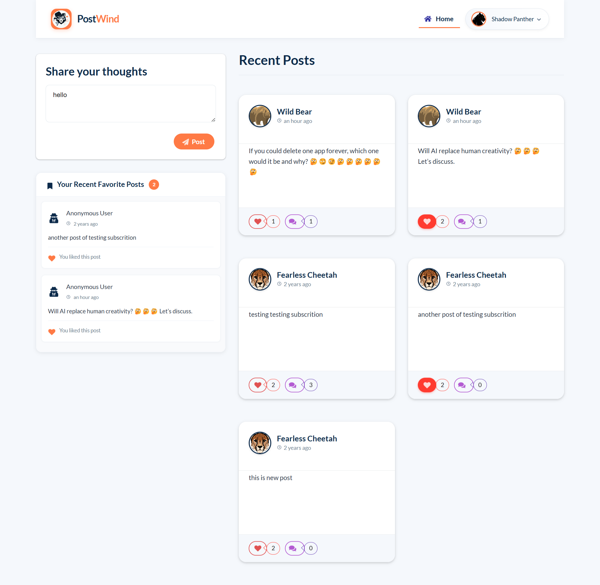
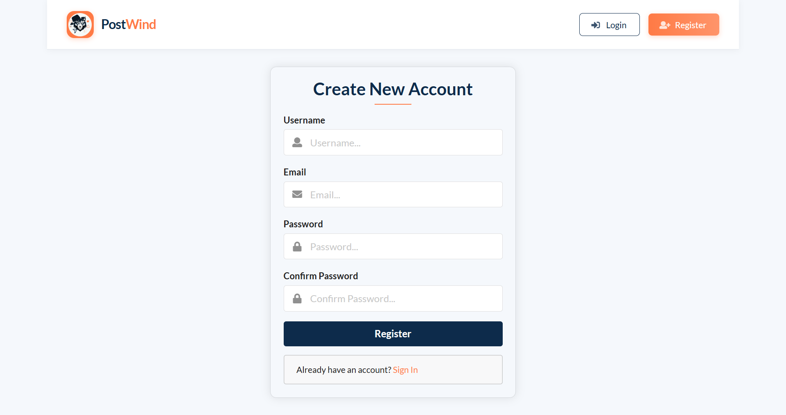
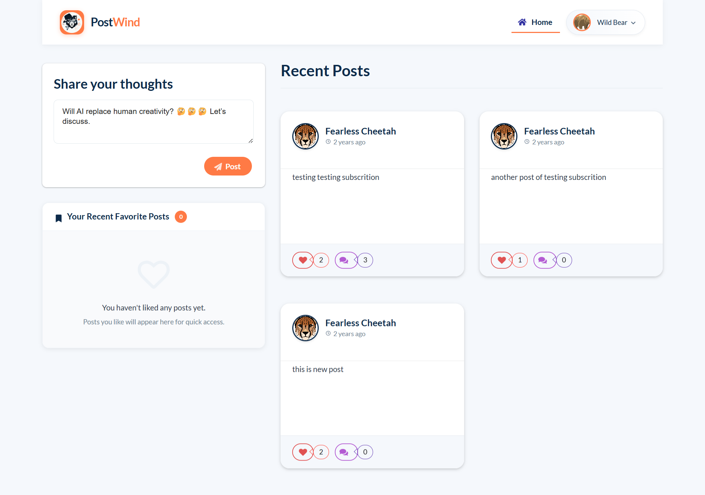
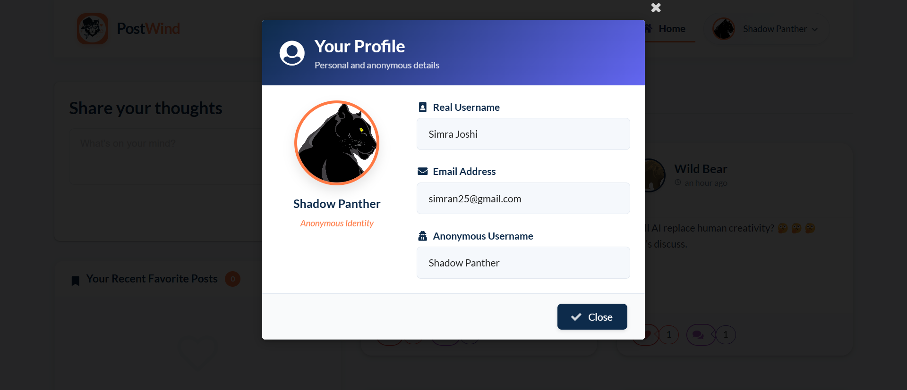
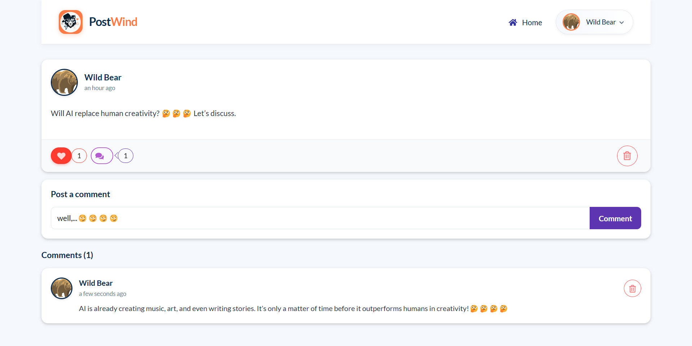
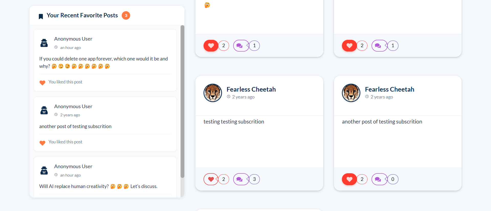
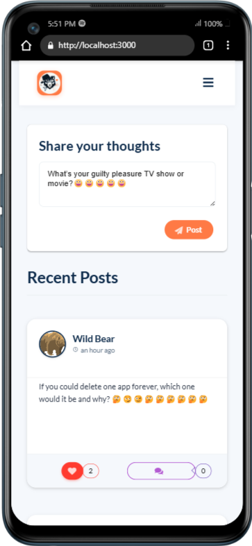

# 🎭 PostWind

<p align="center">
  
</p>

_**PostWind** – An anonymous social platform where users can freely express themselves, share thoughts, and engage with content without revealing their true identity – fostering genuine expression in a privacy-focused environment._

## ✨ What This Project Does

**PostWind** is an innovative and fully responsive social media platform designed with privacy at its core. Users register with their real credentials but are automatically assigned an anonymous identity that shields their personal information from other users. This anonymity empowers users to express their true thoughts, opinions, and feelings without fear of judgment or repercussion. The platform features a comprehensive post management system where users can create, view, like, and comment on posts. A unique "favorites" feature automatically saves liked posts for quick access later, even if the original post is deleted. With a clean, responsive interface, PostWind delivers a seamless user experience across all devices while maintaining its primary focus on privacy and freedom of expression.

## 🚀 Live Demo

Experience the project in action:

- 🌐 [Live Demo Link](https://aniket-bhadra.github.io/)

## 📸 Preview

### 🏠 Home Page



_Browse through anonymous posts, interact with content, and access your saved favorite posts all in one intuitive interface._

---

## 🎞️ Interactive Previews

### 🔑 Getting Started


_From registration to anonymous posting – see how your identity remains protected while you express yourself freely._

### 💬 Social Interaction


_Watch how users engage with posts through likes and comments while maintaining complete anonymity._

## 📷 Additional Screenshots

### Login Page



_Secure authentication while maintaining user privacy with our anonymous system._


### Post Creation




_Express your thoughts freely with our intuitive post creation interface._


### Anonymous Profile




_View your unique anonymous identity alongside your saved posts and account information._


### Comments Section




_Engage in meaningful discussions while maintaining complete anonymity._


### Saved Favorites




_Quick access to all your favorite posts for future reference._


### Mobile Responsive Design




_Access all features seamlessly on any device with our fully responsive design._


## ✨ Features

- 🎭 **Anonymous Identity System**: Real credentials for login, anonymous identity for interactions.
- 🔐 **Privacy-First Design**: User's real identity is never exposed to other platform users.
- 📝 **Post Creation & Management**: Share thoughts, ideas, and opinions anonymously.
- 👍 **Interactive Engagement**: Like and comment on posts while maintaining anonymity.
- 🔖 **Automatic Favorites**: Liked posts are automatically saved for future reference.
- 💾 **Persistent Favorites**: Saved posts remain accessible even if the original is deleted.
- 🧵 **Comment Threading**: Engage in threaded discussions on posts.
- 👁️ **Content Discovery**: Browse and discover anonymous posts from across the platform.
- 🔄 **Real-time Updates**: See new posts and interactions without refreshing.
- 👤 **Profile Management**: View and manage your anonymous identity and account settings.
- 📱 **Fully Responsive Design**: Seamless experience across desktop, tablet, and mobile devices.
- 🎨 **Clean UI/UX**: Intuitive interface that prioritizes content and user experience.

## 🛠 Tech Stack

### 🚀 Frontend

- **Framework**: React 18
- **State Management**: Context API
- **GraphQL Client**: Apollo Client 3.7.10
- **Authentication**: JWT-Decode 3.1.2
- **Routing**: React Router DOM 6.9.0
- **UI Framework**: Semantic UI React 2.1.4
- **Date Handling**: Moment.js 2.29.4
- **Notifications**: React-Toastify 11.0.5

### 🖥️ Backend

- **Server**: Apollo Server 2.5.0
- **API**: GraphQL 14.3.1
- **Database**: MongoDB with Mongoose 5.5.11
- **Authentication**: JWT 8.5.1 with Bcrypt 2.4.3

### 🚢 Deployment

- **Frontend**: Vercel
- **Backend**: Heroku
- **Database**: MongoDB Atlas

## 🔧 Installation

1. Clone the repository and navigate to the project folder:

   ```bash
   git clone https://github.com/yourusername/postWind.git
   cd postWind
   ```

2. Install dependencies for both frontend and backend:

   ```bash
   # Install client dependencies
   cd client
   npm install
   ```

   Open a new terminal:

   ```bash
   # Install server dependencies
   npm install
   ```

3. Configure environment variables:

   Create a `configuration.js` file in the server directory with the following:

   ```
   MONGODB_CONNECTION_STRING=your_mongodb_connection_string
   JWT_SECRET=your_jwt_secret
   ```

4. Start the development servers:

   Backend:

   ```bash
   npm start
   ```

   Frontend:

   ```bash
   cd client
   npm start
   ```

# 🎮 Usage

- Locally, you can access the platform at `localhost:3000`.
- On the server, it is available at `localhost:5000`.

1. Register with your email and password.
2. Log in to receive your anonymous identity.
3. Create posts to share your thoughts anonymously.
4. Browse the feed to see what others are posting.
5. Like posts to automatically save them to your favorites.
6. Comment on posts to engage in anonymous discussions.
7. View your profile to see your anonymous identity and account details.

## 🤝 Contributing

We welcome contributions! Please follow these steps:

1. Fork the repository
2. Create your feature branch (`git checkout -b feature/AmazingFeature`)
3. Commit your changes (`git commit -m 'Add some AmazingFeature'`)
4. Push to the branch (`git push origin feature/AmazingFeature`)
5. Open a Pull Request


## 📬 Contact

- linkedin - [https://www.linkedin.com/in/aniket-bhadra/](https://www.linkedin.com/in/aniket-bhadra/)
- Email - aniketbhadra2@gmail.com

## 📊 Project Metrics

&nbsp;&nbsp;&nbsp;&nbsp;
&nbsp;&nbsp;&nbsp;&nbsp;
&nbsp;&nbsp;&nbsp;&nbsp;
&nbsp;&nbsp;&nbsp;&nbsp;


## 💻 Project Details

&nbsp;&nbsp;&nbsp;&nbsp;
&nbsp;&nbsp;&nbsp;&nbsp;
&nbsp;&nbsp;&nbsp;&nbsp;
&nbsp;&nbsp;&nbsp;&nbsp;

### 📊 Project Overview

| 📌 **Metric**          | 📊 **Value**     |
| ---------------------- | ---------------- |
| 📈 **Total Commits**   | 843              |
| 🕒 **Last Commit**     | 2024-03-15       |
| 💾 **Repo Size**       | 12.8 MB          |
| 📝 **Languages Count** | 4                |
| 💡 **Top Language**    | JavaScript - 72% |
| ❓ **Open Issues**     | 5                |
| 🌐 **Platform**        | Web, Mobile      |
| 📦 **Dependencies**    | 12               |
| 📅 **Version**         | 1.0.0            |
| 🚀 **Status**          | Deployed         |

## 🚀 Upcoming Future Feature Progress

- 🔍 **Advanced Search**: Find posts by content or topics ░░░░░░░░░░░░░░░░░░░░ 0%

- 🔔 **Notification System**: Get alerts for interactions on your posts ▓▓▓░░░░░░░░░░░░░░░░░░ 20%

- 🏷️ **Tagging System**: Organize and discover content by tags ░░░░░░░░░░░░░░░░░░░░ 0%

Made with ❤️ by [Aniket Bhadra](https://github.com/aniket-bhadra/)
